# Pull, Otimização e Avaliação de Prompts com LangChain e LangSmith

Este projeto pega um prompt de baixa qualidade publicado no LangSmith Prompt Hub, reescreve esse prompt com técnicas de Prompt Engineering e mede o resultado com métricas automáticas.

O prompt converte relatos de bug em User Stories. A versão original (`leonanluppi/bug_to_user_story_v1`) é baixada do Hub e salva em YAML. A versão otimizada (`bug_to_user_story_v2`) é escrita localmente, publicada de volta no Hub como prompt público e avaliada contra um dataset de 15 bugs. As notas ficam registradas no LangSmith.

---

## Objetivo

- Fazer **pull** do prompt `leonanluppi/bug_to_user_story_v1` do LangSmith Prompt Hub e salvar em `prompts/bug_to_user_story_v1.yml`.
- **Otimizar** o prompt em `prompts/bug_to_user_story_v2.yml`, aplicando Few-shot Learning (obrigatório) e pelo menos uma técnica adicional.
- Fazer **push** do prompt otimizado para o Hub como `{seu_username}/bug_to_user_story_v2`, público e com metadados (descrição, tags e técnicas aplicadas).
- **Avaliar** o prompt com 5 métricas: Helpfulness, Correctness, F1-Score, Clarity e Precision.
- Atingir **nota mínima de 0.8 em cada uma das 5 métricas**, e não só na média.
- **Validar** a estrutura do prompt com testes automatizados (`pytest`).

---

## 📁 Estrutura do repositório

```
mba-ia-pull-evaluation-prompt/
├── .env.example                  # Template das variáveis de ambiente
├── requirements.txt              # Dependências Python
├── README.md                     # Esta documentação
│
├── prompts/
│   ├── bug_to_user_story_v1.yml  # Prompt original, obtido via pull
│   └── bug_to_user_story_v2.yml  # Prompt otimizado
│
├── datasets/
│   └── bug_to_user_story.jsonl   # 15 bugs de avaliação (5 simples, 7 médios, 3 complexos)
│
├── src/
│   ├── pull_prompts.py           # Pull do v1 do LangSmith Hub → YAML
│   ├── push_prompts.py           # Valida o v2 e faz push público ao Hub
│   ├── evaluate.py               # Avaliação do v2 com as 5 métricas
│   ├── evaluate_v1.py            # Avaliação do v1 (base da tabela comparativa)
│   ├── metrics.py                # Implementação das métricas
│   └── utils.py                  # Funções auxiliares (YAML, .env, LLM)
│
├── tests/
│   └── test_prompts.py           # Testes de validação do prompt v2
│
└── screenshots/                  # Evidências das avaliações no LangSmith
```

`src/evaluate.py`, `src/metrics.py`, `src/utils.py` e o dataset vêm prontos no repositório base e não foram alterados.

---

## 🔄 Fluxo do Projeto

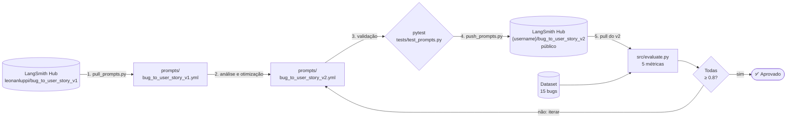

1. **Pull:** o v1 é baixado do Hub e salvo em YAML.
2. **Otimização:** o v2 é escrito a partir da análise dos problemas do v1.
3. **Validação:** o `pytest` confere a estrutura do v2 antes da publicação.
4. **Push:** o v2 é publicado no Hub como prompt público.
5. **Avaliação:** o `evaluate.py` puxa o v2 do Hub e executa os 15 exemplos do dataset. Enquanto alguma métrica ficar abaixo de 0.8, o ciclo volta para a etapa 2.

---

## Como Executar

### Pré-requisitos

- Python 3.9 ou superior
- Git
- Conta no [LangSmith](https://smith.langchain.com) com uma API Key
- API Key de um provedor de LLM:
  - Google Gemini: https://aistudio.google.com/app/apikey (tem camada gratuita)
  - OpenAI: https://platform.openai.com/api-keys (custo estimado de US$ 1 a 5 para o desafio)

---

### Setup do ambiente

1. Clone o repositório e entre na pasta:

```bash
git clone https://github.com/<seu-usuario>/mba-ia-pull-evaluation-prompt.git
cd mba-ia-pull-evaluation-prompt
```

2. Crie e ative o ambiente virtual:

```bash
python -m venv venv

# Windows
venv\Scripts\activate

# Linux / macOS
source venv/bin/activate
```

3. Instale as dependências:

```bash
pip install -r requirements.txt
```

Principais dependências (versões fixadas em `requirements.txt`):

| Pacote | Uso |
|---|---|
| `langchain`, `langchain-core`, `langchain-community` | Pull/push de prompts (`langchain.hub`) e templates |
| `langsmith` | Cliente da API, datasets e avaliação |
| `langchain-openai`, `langchain-google-genai` | Provedores de LLM |
| `python-dotenv` | Carrega o `.env` |
| `pyyaml` | Leitura e escrita dos prompts em YAML |
| `pytest` | Testes de validação |

### Variáveis de ambiente

Copie o template e preencha os valores:

```bash
cp .env.example .env
```

| Variável | Obrigatória | Descrição |
|---|---|---|
| `LANGSMITH_API_KEY` | Sim | API Key do LangSmith |
| `LANGSMITH_TRACING` | Sim | `true` para registrar os traces no LangSmith |
| `LANGSMITH_ENDPOINT` | Sim | `https://api.smith.langchain.com` |
| `LANGSMITH_PROJECT` | Sim | Nome do projeto no LangSmith. O dataset de avaliação é criado como `<LANGSMITH_PROJECT>-eval` |
| `USERNAME_LANGSMITH_HUB` | Sim | Seu username no Hub, usado no nome `{username}/bug_to_user_story_v2`. Para descobrir, publique qualquer prompt no Hub, abra-o e clique no ícone de cadeado (🔒) |
| `LLM_PROVIDER` | Sim | `google` ou `openai` |
| `LLM_MODEL` | Sim | Modelo que responde ao prompt (ex.: `gemini-2.5-flash`, `gpt-4o-mini`) |
| `EVAL_MODEL` | Sim | Modelo que avalia as respostas (ex.: `gemini-2.5-flash`, `gpt-4o`) |
| `GOOGLE_API_KEY` | Se `LLM_PROVIDER=google` | API Key do Gemini |
| `OPENAI_API_KEY` | Se `LLM_PROVIDER=openai` | API Key da OpenAI |

Os nomes de modelos mudam com frequência. Confira na documentação do provedor quais estão disponíveis.

---

### Comandos de cada fase

Execute todos os comandos a partir da raiz do projeto, com o ambiente virtual ativo.

**1. Pull do prompt original (v1)**

```bash
python src/pull_prompts.py
```

Baixa `leonanluppi/bug_to_user_story_v1` do Hub e salva em `prompts/bug_to_user_story_v1.yml`.

**2. Otimização do prompt (v2)**

Esta fase é manual: edite `prompts/bug_to_user_story_v2.yml`. O arquivo deve ter `system_prompt`, `user_prompt` (com a variável `{bug_report}`) e a lista `techniques_applied`.

**3. Testes de validação**

```bash
pytest tests/test_prompts.py -v
```

Verifica se o v2 tem system prompt, persona, formato de saída, exemplos few-shot, nenhum `[TODO]` e pelo menos 2 técnicas nos metadados.

**4. Push do prompt otimizado**

```bash
python src/push_prompts.py
```

Valida o v2 e publica `{USERNAME_LANGSMITH_HUB}/bug_to_user_story_v2` como prompt **público**, com descrição, tags e técnicas aplicadas. Se o Hub já tiver a mesma versão, o script informa `nothing to commit` e termina com sucesso.

**5. Avaliação do prompt otimizado**

```bash
python src/evaluate.py
```

Cria ou atualiza o dataset no LangSmith, puxa o v2 do Hub, executa os 15 exemplos e mostra as 5 métricas. O status é `APROVADO` quando todas as métricas ficam ≥ 0.8. O `evaluate.py` avalia a versão publicada no Hub, então faça o push (fase 4) antes de cada avaliação.

**6. Avaliação do prompt original (opcional)**

```bash
python src/evaluate_v1.py
```

Avalia o v1 com as mesmas métricas e o mesmo dataset, para preencher a tabela comparativa v1 × v2. Os traces vão para um projeto separado (`<LANGSMITH_PROJECT>-v1`).

### Ciclo de iteração

Para melhorar as notas, repita as fases 2 → 3 → 4 → 5 até todas as métricas atingirem 0.8. Use o Tracing do LangSmith para ver por que um exemplo teve nota baixa.

---
## 🧠 Técnicas de Prompt Engineering Aplicadas (Fase 2)

### Problemas do prompt original (v1)

```yaml
system_prompt: |
  Você é um assistente que ajuda a transformar relatos de bugs de usuários em tarefas para desenvolvedores.
  Analise o relato de bug abaixo e crie uma user story a partir dele.
  ...
user_prompt: '{bug_report}'
```

| Problema no v1 | Consequência |
|---|---|
| Persona genérica ("um assistente") | Respostas sem o ponto de vista de produto e sem foco no valor para o usuário |
| Nenhum formato de saída definido | Cada resposta sai com uma estrutura diferente, às vezes em markdown, às vezes com título |
| Sem exemplos | O modelo não sabe o nível de detalhe esperado nem como escrever os critérios de aceitação |
| Sem regras | O modelo inventa causas e números e acrescenta funcionalidades que não estão no relato |
| `{bug_report}` no system prompt **e** no user prompt | O relato é enviado duas vezes e a instrução se mistura com a entrada |
| Sem tratamento de casos limite | Relatos vagos, com vários problemas ou com detalhes técnicos recebem o mesmo tratamento |

### Técnicas escolhidas

O v2 registra três técnicas em `techniques_applied`: `few_shot`, `role_prompting` e `chain_of_thought`.

| Técnica | Por que foi escolhida | Onde está no v2 |
|---|---|---|
| **Role Prompting** | Escrever uma User Story é trabalho de Product Manager. A persona define o vocabulário, o público e o foco no benefício de negócio | Primeiro parágrafo do `system_prompt` |
| **Few-shot Learning** (obrigatória) | Mostrar o resultado esperado é mais preciso do que descrevê-lo. Os exemplos ensinam o formato, o nível de detalhe e o estilo dos critérios | Seção `## Exemplos`, com 8 pares `<relato>` / `<resposta>` |
| **Chain of Thought** | Converter um bug exige análise: identificar a persona, a ação, a motivação e a complexidade antes de escrever | Seção `## Como raciocinar`, com 6 passos |

#### Role Prompting

```text
Você é um Product Manager sênior, especialista em transformar relatos de bugs em User Stories
claras, completas e acionáveis para squads ágeis. Você escreve para desenvolvedores, QA e
stakeholders de negócio, sempre em português do Brasil.
```

A persona define o **papel** (PM sênior), o **público** (dev, QA e negócio) e o **idioma**. Com isso, as respostas passam a abrir com o benefício para o usuário ("para que...") em vez de uma descrição técnica do bug.

#### Few-shot Learning

Os 8 exemplos foram escolhidos para cobrir os tipos de relato do dataset **sem repetir nenhum dos 15 bugs de avaliação**:

| # | Exemplo | O que ensina |
|---|---|---|
| 1 | Contador de aprovações errado | Relato SIMPLES: generalizar o número do sintoma e filtrar por status |
| 2 | Botão não funciona no Firefox | Bug de plataforma: mesma qualidade e tempo similar aos outros navegadores |
| 3 | Integração com a transportadora (HTTP 401) | Persona "o sistema", código HTTP de sucesso, notificação e log de auditoria |
| 4 | Comissão calculada errada | `Exemplo de Cálculo` passo a passo |
| 5 | Menu cortado em tela < 600px | `Critérios de Acessibilidade` e detalhe técnico (`overflow`) só no `Contexto Técnico` |
| 6 | Reserva duplicada de sala | Concorrência: `Critérios de Prevenção` |
| 7 | Histórico de pedidos lento | Meta numérica de desempenho e `Critérios Técnicos` |
| 8 | Plataforma de cursos com 3 falhas | Relato COMPLEXO: blocos A/B/C, tasks técnicas e contexto do bug |

Os exemplos ficam entre tags `<exemplo>`, `<relato>` e `<resposta>`, e o checklist final proíbe essas tags na saída. Assim, o modelo separa o que é exemplo do que é resposta.

#### Chain of Thought

```text
Antes de escrever, pense passo a passo:
1. Persona: quem sofre o problema? ...
2. Ação: o que essa persona quer fazer e hoje não consegue?
3. Motivação: qual o benefício de negócio ou para o usuário ...?
4. Complexidade: classifique o relato (SIMPLES, MÉDIO ou COMPLEXO).
5. Detalhes: liste as condições, filtros, status, plataformas, endpoints ...
6. Comportamento esperado: ... não acrescente funcionalidades novas.
```

O raciocínio é **interno**: o prompt pede para não escrevê-lo na resposta. Assim, o modelo aproveita a análise sem poluir a User Story, o que ajuda a manter a nota de Clarity. O passo 4 é o mais importante, porque a classificação de complexidade escolhe qual dos três formatos de resposta será usado.

### Outras práticas aplicadas

- **Formato explícito por complexidade:** SIMPLES (5 critérios, sem seções extras), MÉDIO (seções opcionais conforme o relato) e COMPLEXO (estrutura fixa com `=== USER STORY PRINCIPAL ===`, `=== CRITÉRIOS DE ACEITAÇÃO ===` e as demais seções).
- **12 regras de comportamento:** fidelidade ao relato (dados ausentes entre colchetes), limites para deduções, tratamento de números, metas de desempenho numéricas, segurança (HTTP 403 e log de auditoria), sintomas viram critérios negativos ("não deve ocorrer...").
- **Casos limite:** relato vago (Regra 9), relato com vários problemas (Regra 10), detalhes de implementação (Regra 11) e bugs restritos a uma plataforma (Regra 6).
- **Separação System vs User:** todas as instruções ficam no `system_prompt`. O `user_prompt` contém só o relato (`{bug_report}`) entre delimitadores `---`.
- **Checklist final:** uma lista de autoverificação no fim do prompt, que o modelo confere antes de responder.

---

## 📊 Resultados Finais

Todas as execuções usaram o mesmo dataset (`bug-to-user-story-challenge-eval`, 15 exemplos), com o provider **OpenAI**: `gpt-4o-mini` como modelo principal e `gpt-4o` como modelo de avaliação.

| Execução | Prompt | Helpfulness | Correctness | F1-Score | Clarity | Precision | Média | Status |
|---|---|:---:|:---:|:---:|:---:|:---:|:---:|:---:|
| Execução 1 — V1 (versão original) | `bug_to_user_story_v1` | 0.85 ✓ | **0.79 ✗** | **0.73 ✗** | 0.86 ✓ | 0.84 ✓ | 0.8151 | ❌ Reprovado |
| Execução 2 — V2, Round 1 | `bug_to_user_story_v2` | 0.86 ✓ | 0.81 ✓ | **0.79 ✗** | 0.89 ✓ | 0.82 ✓ | 0.8344 | ❌ Reprovado |
| Execução 3 — V2, Round 2 | `bug_to_user_story_v2` | 0.88 ✓ | 0.85 ✓ | 0.83 ✓ | 0.89 ✓ | 0.86 ✓ | 0.8608 | ✅ Aprovado |
| Execução 4 — V2, Round 3 | `bug_to_user_story_v2` | 0.88 ✓ | 0.87 ✓ | 0.86 ✓ | 0.89 ✓ | 0.87 ✓ | **0.8737** | ✅ Aprovado |

No Round 1, só o F1-Score ficou abaixo do mínimo (0.79). A partir do Round 2, as 5 métricas passaram de 0.8. O Round 3 melhorou mais três métricas e a média subiu para 0.8737.

---

## 📈 Tabela Comparativa de Performance

### V1 (original) × V2 (versão final, Round 3)

| Métrica | V1 | V2 final | Diferença |
|---|:---:|:---:|:---:|
| Helpfulness | 0.85 | 0.88 | +0.03 |
| Correctness | 0.79 ✗ | 0.87 | +0.08 |
| F1-Score | 0.73 ✗ | 0.86 | **+0.13** |
| Clarity | 0.86 | 0.89 | +0.03 |
| Precision | 0.84 | 0.87 | +0.03 |
| **Média** | 0.8151 | **0.8737** | +0.0586 |

O v1 foi reprovado em duas métricas: F1-Score (0.73) e Correctness (0.79). O maior ganho do v2 foi no F1-Score (+0.13), que também puxou a Correctness (+0.08). As outras métricas subiram 0.03 cada.

### Evolução do V2 entre as iterações

| Métrica | Round 1 | Round 2 | Round 3 | Ganho (R1 → R3) |
|---|:---:|:---:|:---:|:---:|
| Helpfulness | 0.86 | 0.88 | 0.88 | +0.02 |
| Correctness | 0.81 | 0.85 | 0.87 | +0.06 |
| F1-Score | 0.79 | 0.83 | 0.86 | **+0.07** |
| Clarity | 0.89 | 0.89 | 0.89 | 0.00 |
| Precision | 0.82 | 0.86 | 0.87 | +0.05 |
| **Média** | 0.8344 | 0.8608 | 0.8737 | +0.0393 |

---

## 🔍 Análise Crítica dos Resultados e Relação entre as Métricas

### Como as métricas se relacionam

O `evaluate.py` calcula três métricas base por exemplo, usando o modelo de avaliação como juiz (LLM-as-a-judge). As outras duas são **derivadas** dessas três:

```text
Helpfulness = (Clarity + Precision) / 2
Correctness = (F1-Score + Precision) / 2
```

Isso tem três consequências:

- **Precision é a métrica com mais peso.** Ela entra nas duas derivadas, então 0.01 a mais em Precision vale 0.01 a mais na soma de Helpfulness e Correctness.
- **Correctness depende do F1-Score.** No Round 1, o F1 de 0.79 segurou a Correctness em 0.81, perto do limite. Quando o F1 subiu 0.07, a Correctness subiu 0.06.
- **Helpfulness só mudou por causa da Precision.** A Clarity ficou em 0.89 nas três rodadas, então todo o ganho de Helpfulness (+0.02) veio da Precision.

### O que os números mostram

- **O formato estava resolvido desde o Round 1.** A Clarity estável em 0.89 indica que a estrutura da resposta (persona + formato por complexidade + exemplos) já funcionava na primeira versão. As iterações seguintes não precisaram mexer no formato.
- **O gargalo foi o conteúdo, não a forma.** O F1-Score, que compara as informações da resposta com a referência (precisão × cobertura), foi a única métrica reprovada e a que mais evoluiu. Os ajustes foram na fidelidade ao relato: regras de números, detalhes que precisam aparecer e limite para deduções.
- **O exemplo 15 é um ponto fora da curva.** Ele teve Precision 0.33 nas três rodadas, enquanto nos Rounds 2 e 3 os outros exemplos ficaram entre 0.80 e 1.00. Só esse exemplo tira cerca de 0.04 da média de Precision. No v1, o mesmo exemplo teve Precision 0.67, então aqui o v2 piorou em relação ao original. Uma hipótese é que o formato detalhado do v2 leve o modelo a incluir informações que a referência não tem, mas isso só pode ser confirmado analisando o trace desse exemplo. É o principal ponto a investigar numa próxima iteração.
- **Nem toda iteração melhora todos os exemplos.** No Round 3, o F1 do exemplo 5 caiu de 0.75 para 0.65, enquanto os exemplos 10, 12 e 15 subiram para 1.00. A média melhorou, mas houve regressão local. Por isso é importante olhar as notas por exemplo, e não só a média.
- **Alguns exemplos ficaram estáveis em 0.75 de F1** (exemplos 1, 2 e 6 nas três rodadas). Há espaço para melhorar a cobertura desses casos.

### Limitações

- **A margem é pequena.** O F1-Score final (0.86) está 0.06 acima do mínimo. Como o juiz é um LLM, as notas podem variar um pouco entre execuções, e uma rodada desfavorável pode aproximar alguma métrica de 0.8.
- **Prompt longo.** O arquivo do v2 tem cerca de 370 linhas, das quais a maior parte são os 8 exemplos. Isso aumenta o custo em tokens de cada chamada, em troca de respostas mais consistentes.
- **Resultados ligados ao modelo.** As notas foram obtidas com `gpt-4o-mini` respondendo e `gpt-4o` avaliando. Com outro provider ou modelo (por exemplo, Gemini), os resultados precisam ser reavaliados.

---

## 🧾 Evidências do LangSmith

- **Dashboard público do LangSmith:** << link público do dashboard >>
- **Prompt v2 público no Hub:** << link público de `valeria-ai-lab/bug_to_user_story_v2` >>

### Dataset de avaliação com 15 exemplos

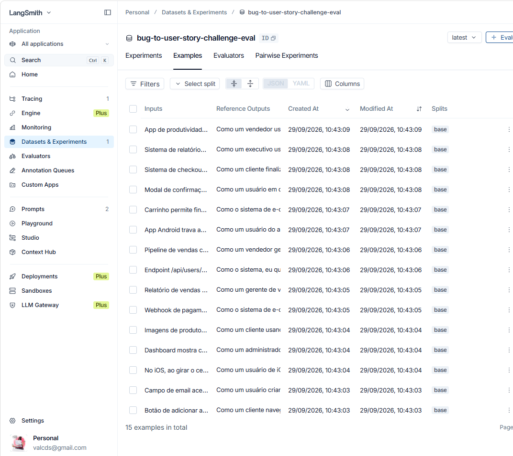

### Execuções do V2 com as métricas

| Round 1 (reprovado) | Round 2 (aprovado) | Round 3 (aprovado) |
|---|---|---|
| 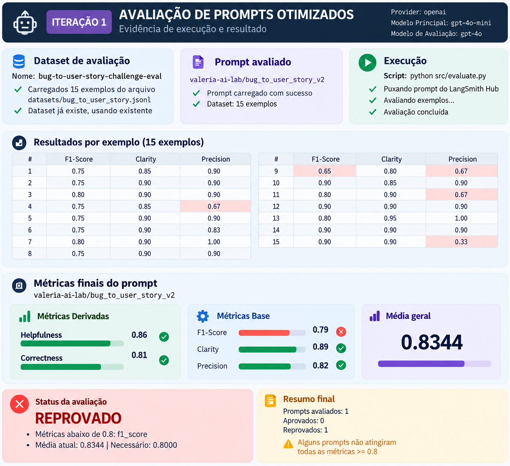 | 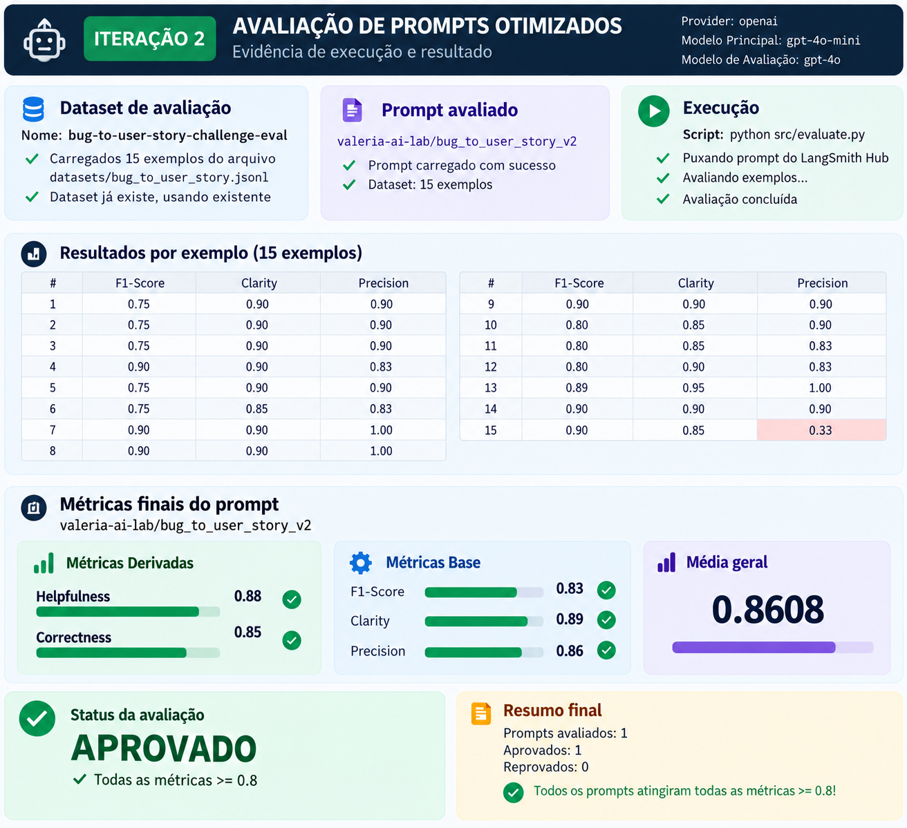 | 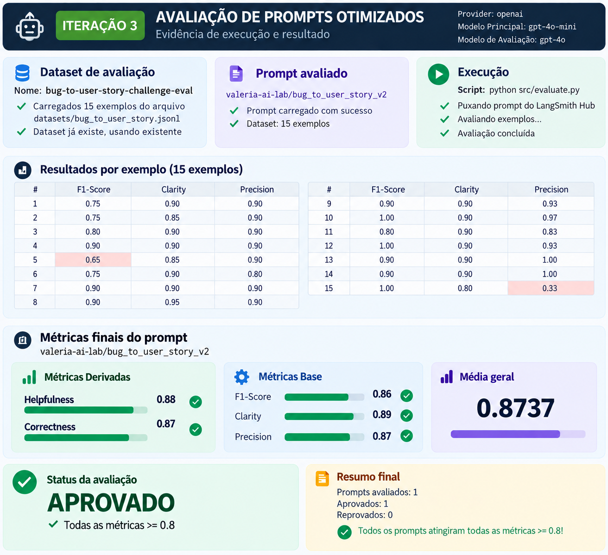 |

### Tracing detalhado

| Exemplo 1 | Exemplo 2 | Exemplo 3 |
|---|---|---|
| 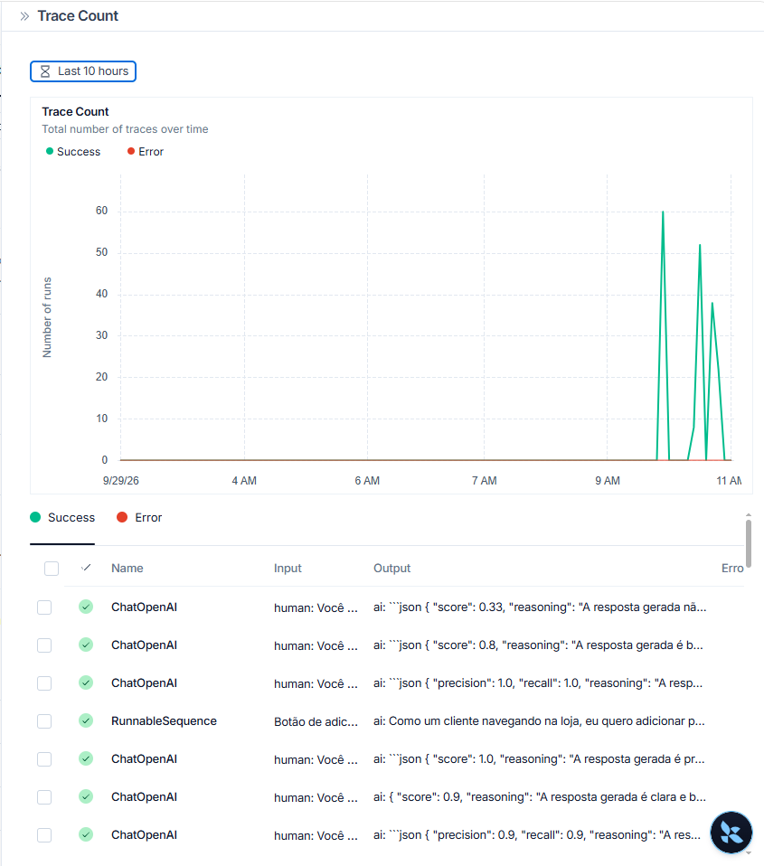 | 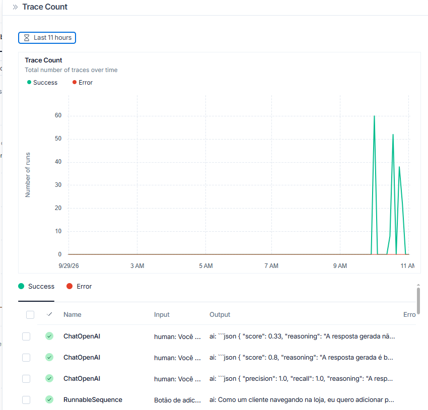 | 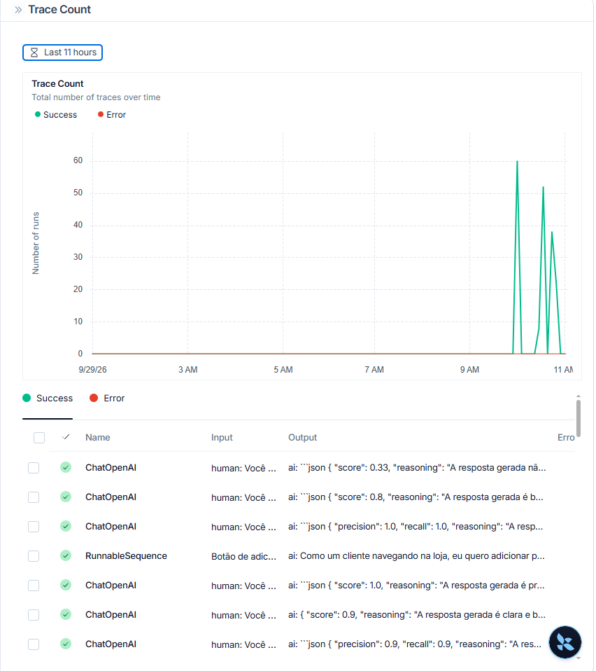 |

### Traces por iteração

| Iteração 1 | Iteração 2 | Iteração 3 |
|---|---|---|
| 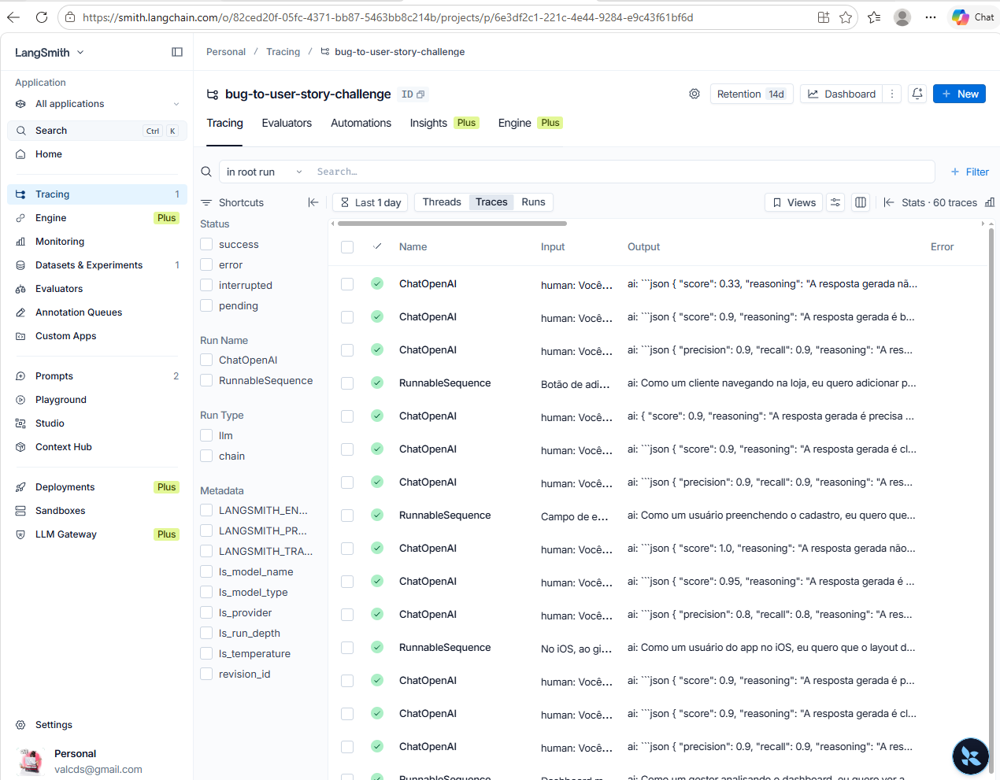 | 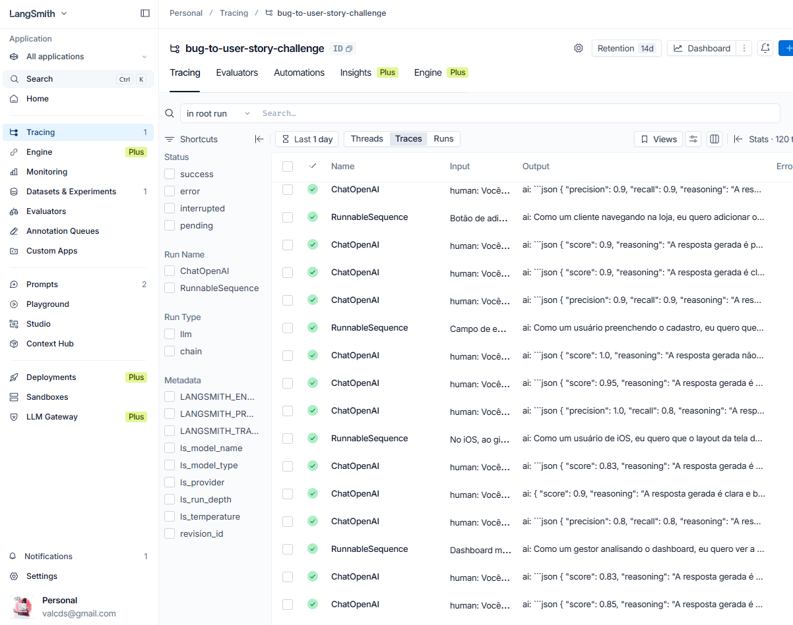 | 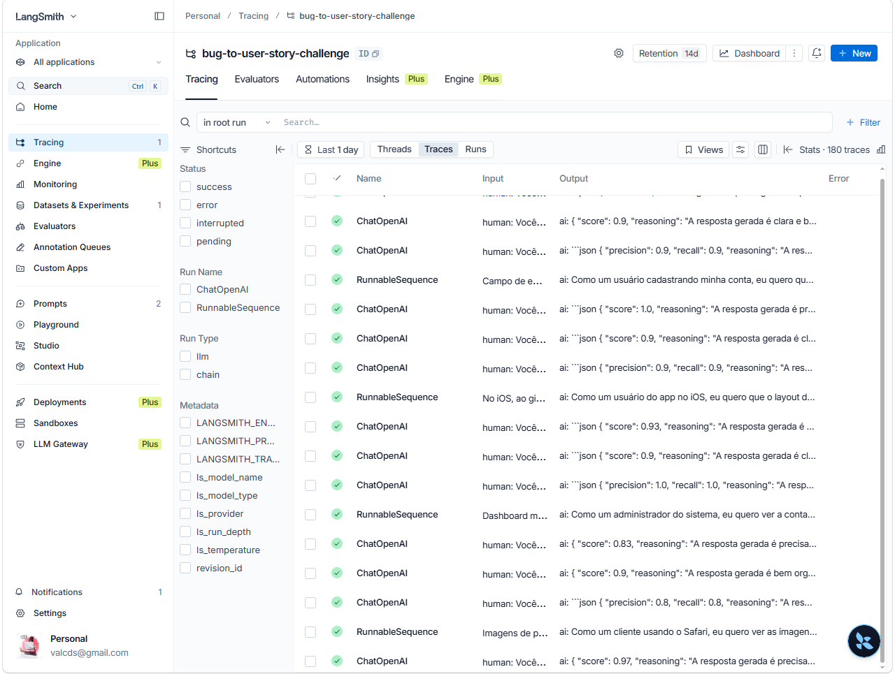 |

---

### 📄 Licença
Este projeto foi desenvolvido para o MBA de Engenharia de Software com IA - Full Cycle.

---
🚀 Desenvolvido por Valéria Sousa (@ValSousa)